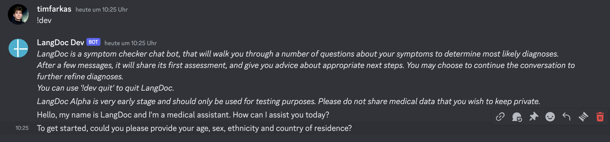
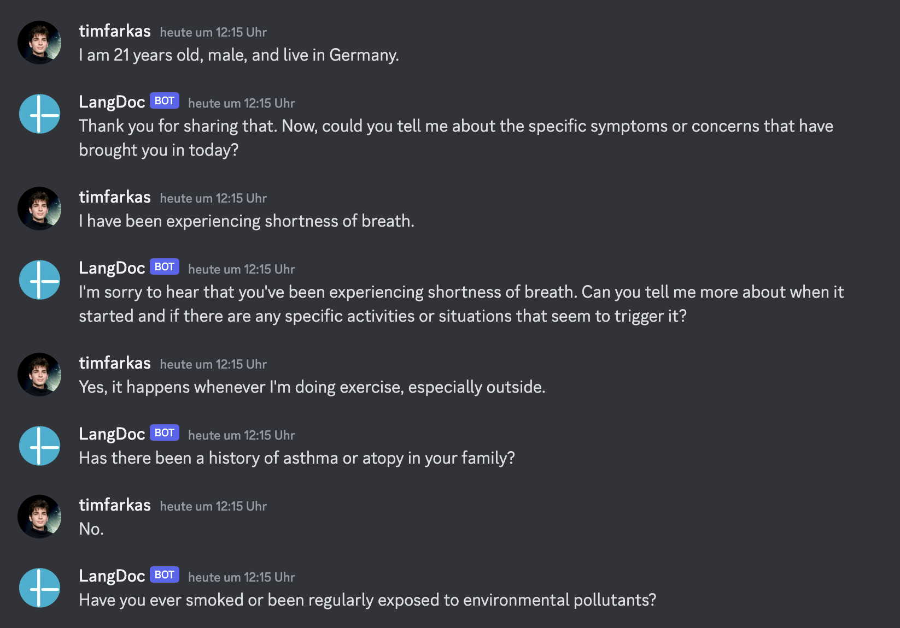
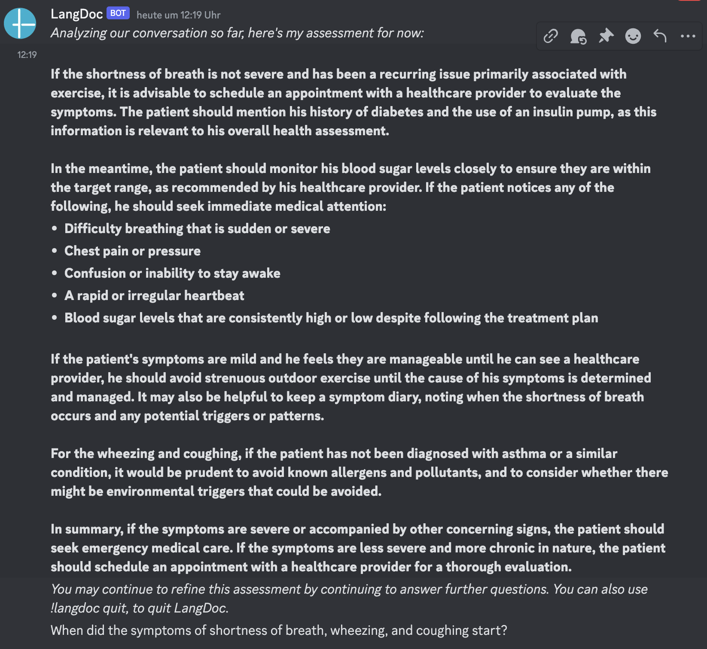

Note: LangDoc is not under active maintenance at the moment. Contact mail [AT] timfarkas.com if you are interested in continuing development.
# LangDoc

LangDoc (LangDoc.AI) is an accessible open-source symptom checker and anamnesis tool that can interview patients about their symptoms in natural language via a simple chat interface - in all prominent languages. 

View the [LangDoc Memo here](https://timfarkas.notion.site/LangDoc-804e17040ca04439b06b92ee12275d07?pvs=4).


### **Current Features**
- ⇒ **Interviews patients in natural language via chat** in an empathic and professional manner
- ⇒ Supports all large languages out of the box
- ⇒ Dynamically gathers information on relevant symptoms 
- ⇒ Compiles a comprehensive overview of symptoms, patient history, and other patient data
- ⇒ Generates a concise summary of the case to inform the clinician's anamnesis subsequently
- ⇒ Planned features: voice chat and direct interface with hospital information systems (e.g. FHIR)

### Try it yourself
For quick set-up, you can join the [LangDoc Discord server](https://discord.gg/qnZX6766mA) to chat with LangDoc directly. 
**Please note that I am not currently running an online instance of LangDoc, which means by default LangDoc will not be answering questions right now.**
However, it is not difficult to set up LangDoc yourself if you have an OpenAI API key: 
#### Setting up LangDoc locally
1. Clone this repository via `git clone https://github.com/timfarkas/LangDoc.git`
2. Install required packages with Pip using `pip install -r requirements.txt`
3. Create a file called `.env`` in the project folder
4. Enter your OpenAI API Key into the `.env` file like so
```.env
  OPENAI_API_KEY = "ENTER_YOUR_KEY_HERE"
```
5. Run `main.py`
6. Activate LangDoc in the Discord server using `!dev` 

#### Hosting LangDoc
Please refer to Technical details

# Demo
### Initializing a conversation
*LangDoc is activated using the '!langdoc' command ('!dev' if in development mode).*


### Powerful dynamic anamnesis capabilities
*Example conversation with fake medical data* 


### Tailored and professional assessment
*Initial assessment, which can be refined by answering further questions.*


# Technical details
The essence of LangDoc is a powerful, modular LangChain-based cognitive architecture that dynamically asks patient interview questions, summarizes all patient information, tracks possible diagnoses, and thus dynamically structures the interview based on the individual case.

By default, it currently uses sub-agents driven by OpenAI foundation models (GPT-4 and GPT-3.5-Turbo), however it was designed to work well in a foundation-model-agnostic way, and can easily be reconfigured to utilize other models (e.g. LLAMA2, MedPaLM, etc.). 

At the moment, LangDoc is using Discord as an easy-to-use and robust front-end chat interface. However, it was designed to be deployble in other contexts as well, e.g. speech assistants, web/smartphone apps, or command line (for testing).


This LangDoc repository is currently being initialized using uvicorn, allowing it to be deployed locally (by running `main.py`), or remotely: 
  Its setup allows it to be instantly deployed to a [FastAPI](https://fastapi.tiangolo.com/) server, e.g. on [Railway](https://railway.app).


For further questions, don't hesitate to contact me at mail [AT] timfarkas.com!